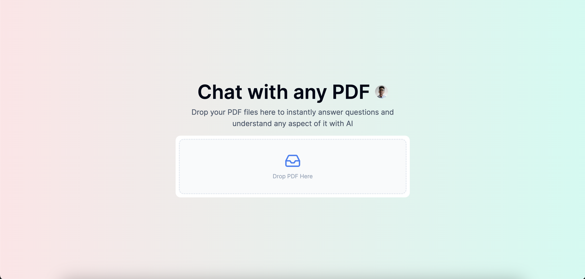

# ChatPDF

## Background

This project is a clone of the well-known website [www.chatpdf.com](https://www.chatpdf.com/). The primary objective behind recreating this application is to explore and learn new technologies, as well as expand my knowledge base.



## Getting Started

To clone the repository, run the following:

```bash
git clone https://github.com/dan-niles/ai-chatpdf.git
cd ai-chatpdf
```

Install depenencies by running:

```bash
npm install
```

Then, run the development server:

```bash
npm run dev
```

Open [http://localhost:3000](http://localhost:3000) with your browser to see the application.
